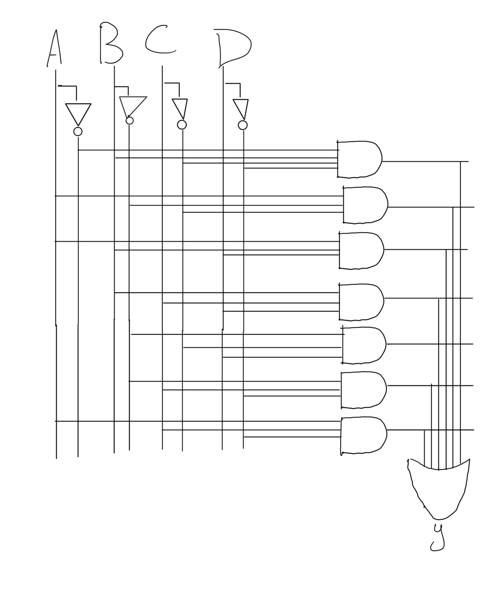

# Homework 6 - Logic

Complete the following logic sections check out slides from chapter 2.

## SOP Boolean Equations

(10 Points) Write a Boolean equation in sum-of-products canonical
form for each of the truth tables:

1. 
| A | B | C | Y | minterm|
| - | - | - | - | - |
| 0 | 0 | 0 | 0 | (~A)(~B)(~C)|
| 0 | 0 | 1 | 1 | (~A)(~B)C|
| 0 | 1 | 0 | 1 | (~A)B(~C)|
| 0 | 1 | 1 | 1 | (~A)BC|
| 1 | 0 | 0 | 1 | A(~B)(~C)|
| 1 | 0 | 1 | 0 | A(~B)C|
| 1 | 1 | 0 | 0 | AB(~C)|
| 1 | 1 | 1 | 0 | ABC|

equation: (~A)(~B)C + (~A)B(~C) + (~A)BC + A(~B)(~C).

2. 
| A | B | C | Y | minterm|
| - | - | - | - | - |
| 0 | 0 | 0 | 1 | (~A)(~B)(~C)|
| 0 | 0 | 1 | 0 | (~A)(~B)C|
| 0 | 1 | 0 | 1 | (~A)B(~C)|
| 0 | 1 | 1 | 0 | (~A)BC|
| 1 | 0 | 0 | 0 | A(~B)(~C)|
| 1 | 0 | 1 | 1 | A(~B)C|
| 1 | 1 | 0 | 1 | AB(~C)|
| 1 | 1 | 1 | 1 | ABC|

equation: (~A)(~B)(~C) + (~A)B(~C) + A(~B)C + AB(~C) + ABC.

3. 
| A | B | C | D | Y | minterm|
| - | - | - | - | - | - |
| 0 | 0 | 0 | 0 | 0 | (~A)(~B)(~C)(~D)|
| 0 | 0 | 0 | 1 | 1 | (~A)(~B)(~C)D|
| 0 | 0 | 1 | 0 | 1 | (~A)(~B)C(~D)|
| 0 | 0 | 1 | 1 | 0 | (~A)(~B)CD|
| 0 | 1 | 0 | 0 | 1 | (~A)B(~C)(~D)|
| 0 | 1 | 0 | 1 | 0 | (~A)B(~C)D|
| 0 | 1 | 1 | 0 | 0 | (~A)BC(~D)|
| 0 | 1 | 1 | 1 | 1 | (~A)BCD|
| 1 | 0 | 0 | 0 | 1 | A(~B)(~C)(~D)|
| 1 | 0 | 0 | 1 | 1 | A(~B)(~C)D|
| 1 | 0 | 1 | 0 | 1 | A(~B)C(~D)|
| 1 | 0 | 1 | 1 | 0 | A(~B)CD|
| 1 | 1 | 0 | 0 | 0 | AB(~C)(~D)|
| 1 | 1 | 0 | 1 | 1 | AB(~C)D|
| 1 | 1 | 1 | 0 | 1 | ABC(~D)|
| 1 | 1 | 1 | 1 | 1 | ABCD|

equation: (~A)(~B)(~C)D + (~A)(~B)C(~D) + (~A)B(~C)(~D) + (~A)BCD + A(~B)(~C)(~D) + A(~B)(~C)D + A(~B)C(~D) + AB(~C)D + ABC(~D) + ABCD.

4. 
| A | B | C | D | Y | minterm|
| - | - | - | - | - | - |
| 0 | 0 | 0 | 0 | 1 | (~A)(~B)(~C)(~D)|
| 0 | 0 | 0 | 1 | 0 | (~A)(~B)(~C)D|
| 0 | 0 | 1 | 0 | 1 | (~A)(~B)C(~D)|
| 0 | 0 | 1 | 1 | 0 | (~A)(~B)CD|
| 0 | 1 | 0 | 0 | X | (~A)B(~C)(~D)|
| 0 | 1 | 0 | 1 | X | (~A)B(~C)D|
| 0 | 1 | 1 | 0 | 0 | (~A)BC(~D)|
| 0 | 1 | 1 | 1 | 0 | (~A)BCD|
| 1 | 0 | 0 | 0 | X | A(~B)(~C)(~D)|
| 1 | 0 | 0 | 1 | X | A(~B)(~C)D|
| 1 | 0 | 1 | 0 | 1 | A(~B)C(~D)|
| 1 | 0 | 1 | 1 | 0 | A(~B)CD|
| 1 | 1 | 0 | 0 | 1 | AB(~C)(~D)|
| 1 | 1 | 0 | 1 | 0 | AB(~C)D|
| 1 | 1 | 1 | 0 | 1 | ABC(~D)|
| 1 | 1 | 1 | 1 | 0 | ABCD|

equation: (~A)(~B)(~C)(~D) + (~A)(~B)C(~D) +  A(~B)C(~D) + AB(~C)(~D) + ABC(~D).

## K-Maps

(10 Points) Convert the previous truth tables into K-Maps in the
following tables.

1. 
| AB/C | AB.00 | AB.01 | AB.11 | AB.10 |
| - | - | - | - | - |
| C.0 | 0 | 1 | 0 | 1 |
| C.1 | 1 | 1 | 0 | 0 |

2. 
| AB/C | AB.00 | AB.01 | AB.11 | AB.10 |
| - | - | - | - | - |
| C.0 | 1 | 1 | 1 | 0 |
| C.1 | 0 | 0 | 1 | 1 |

3. 
| AB/CD | AB.00 | AB.01 | AB.11 | AB.10 |
| - | - | - | - | - |
| CD.00 | 0 | 1 | 0 | 1 |
| CD.01 | 1 | 0 | 1 | 1 |
| CD.11 | 0 | 1 | 1 | 0 |
| CD.10 | 1 | 0 | 1 | 1 |

4. 
| AB/CD | AB.00 | AB.01 | AB.11 | AB.10 |
| - | - | - | - | - |
| CD.00 | 1 | X | 1 | X |
| CD.01 | 0 | X | 0 | X |
| CD.11 | 0 | 0 | 0 | 0 |
| CD.10 | 1 | 0 | 1 | 1 |

## Minimal Boolean Equation

(10 Points) Write the minimal boolean equations from the previous
K-Maps:

1. (~A)C + (~A)B +  A(~B)(~C).
2. (~A)(~C) + AB + AC.
3. (~A)B(~C)(~D) + A(~B)(~C) + ABD + BCD + (~B)(~C)D + (~B)C(~D) + AC(~D)
4. (~B)(~D) + AC(~D) + (~C)D

### Markdown Overline Help

To properly not an input variable in markdown use the following:

not A and not B is the following:
```html
<span style="text-decoration:overline">A</span> <span style="text-decoration:overline">B</span>
```

Renders to: <span style="text-decoration:overline">A</span> <span style="text-decoration:overline">B</span>

not (A and B) is the following:
```html
<span style="text-decoration:overline">AB</span>
```
Renders to: <span style="text-decoration:overline">AB</span>

__Important__ keep in mind the separation on the overline they are
different equations.

## Build the Logic Circuits

(10 Points) For all the previous minimal boolean equations draw and
submit the digital circuit diagrams.

1.


2. 


3.



4. 


## Word Problem

Consider a circuit with three inputs A0, A1, A2 representing a number
from 0 to 15. Output P should be TRUE if the number is prime (0 and 1 are
not prime, but 2, 3, 5, and so on, are prime). Output D should be TRUE if
the number is divisible by 3. 

(20 Points) Answer the following questions about the digital circuit.

1. Fill out the truth table for the circuit.

| A0 | A1 | A2 | A3 | P | D |#|
| -- | -- | -- | -  | - | - |-|
|0 | 0 | 0 | 0 |      0 | 1 |0|
|0 | 0 | 0 | 1 |      0 | 0 |1|
|0 | 0 | 1 | 0 |      1 | 0 |2|
|0 | 0 | 1 | 1 |      1 | 1 |3|
|0 | 1 | 0 | 0 |      0 | 0 |4|
|0 | 1 | 0 | 1 |      1 | 0 |5|
|0 | 1 | 1 | 0 |      0 | 1 |6|
|0 | 1 | 1 | 1 |      1 | 0 |7|
|1 | 0 | 0 | 0 |      0 | 0 |8|
|1 | 0 | 0 | 1 |      0 | 1 |9|
|1 | 0 | 1 | 0 |      0 | 0 |10|
|1 | 0 | 1 | 1 |      1 | 0 |11|
|1 | 1 | 0 | 0 |      0 | 1 |12|
|1 | 1 | 0 | 1 |      1 | 0 |13|
|1 | 1 | 1 | 0 |      0 | 0 |14|
|1 | 1 | 1 | 1 |      0 | 1 |15|

2. Fill out the K-Map from the truth table above.

Output P:
| (A0)(A1)/(A2)(A3) | (A0)(A1).00 | (A0)(A1).01 | (A0)(A1).11 | (A0)(A1).10 |
| - | - | - | - | - |
| (A2)(A3).00 | 0 | 0 | 0 | 0 |
| (A2)(A3).01 | 0 | 1 | 1 | 0 |
| (A2)(A3).11 | 1 | 1 | 0 | 1 |
| (A2)(A3).10 | 1 | 0 | 0 | 0 |

Output D:
| (A0)(A1)/(A2)(A3) | (A0)(A1).00 | (A0)(A1).01 | (A0)(A1).11 | (A0)(A1).10 |
| - | - | - | - | - |
| (A2)(A3).00 | 1 | 0 | 1 | 0 |
| (A2)(A3).01 | 0 | 0 | 0 | 1 |
| (A2)(A3).11 | 1 | 0 | 1 | 0 |
| (A2)(A3).10 | 0 | 1 | 0 | 0 |

<em>is 0 divisible by 3????????</em>

3. Give the minimal boolean equation for each output.

- Output P: (~A0)(~A1)(A2) + (~A1)(A2)(A3) + (~A0)(A1)(A3) + (A1)(~A2)(A3)

- Output D: (~A0)(~A1)(A2)(A3) + 
            (~A0)(A1)(A2)(~A3) +
            (A0)(A1)(A2)(A3) +
            (A0)(~A1)(~A2)(A3) +
            (A0)(A1)(~A2)(~A3) +
            (~A0)(~A1)(~A2)(~A3)

4. Sketch the circuit for each output.

P.


D. 


